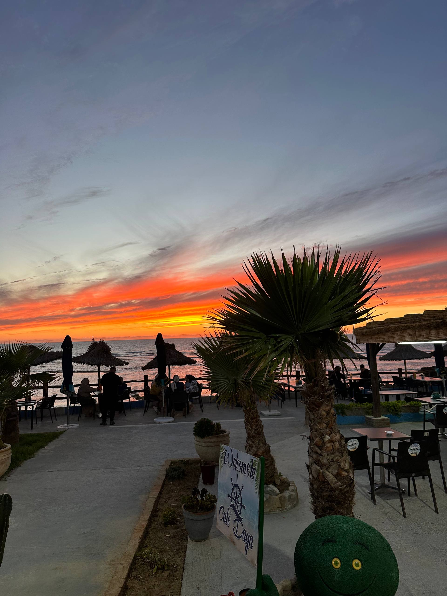
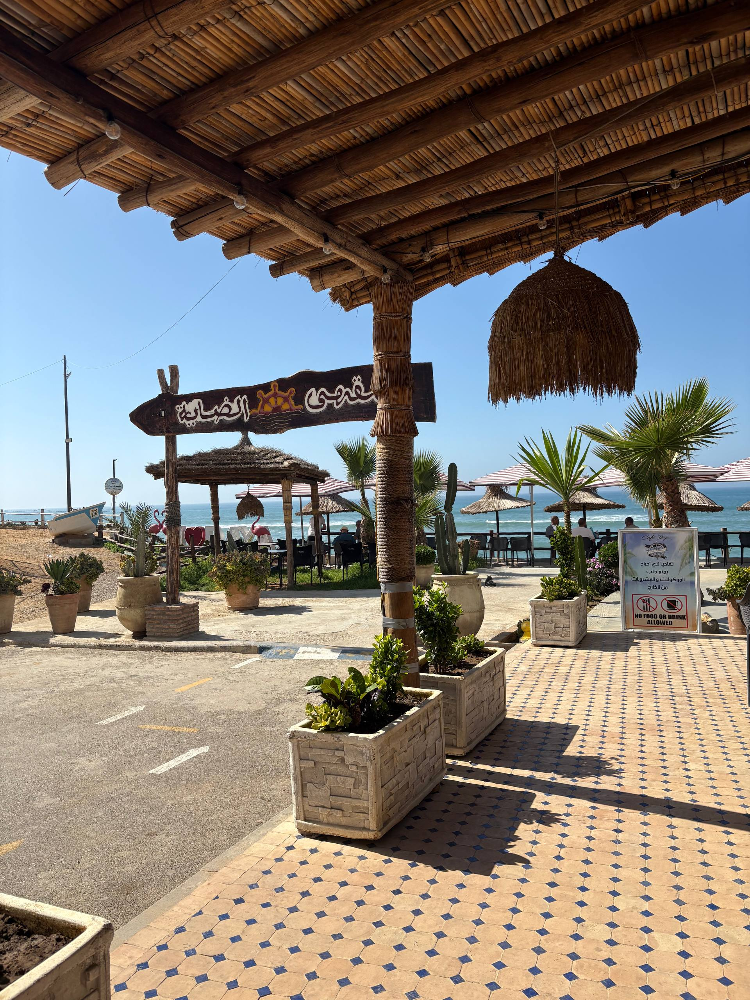
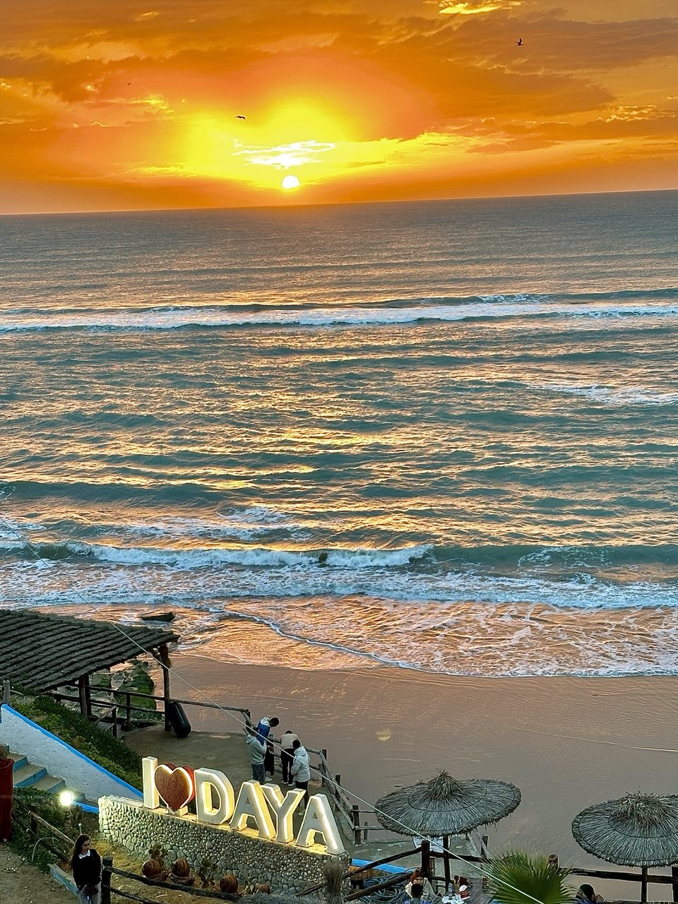
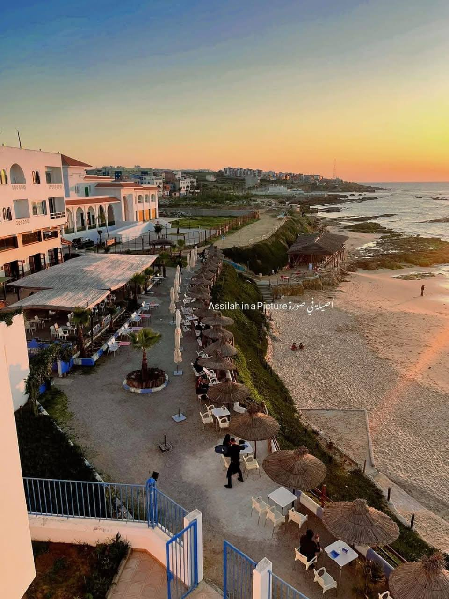
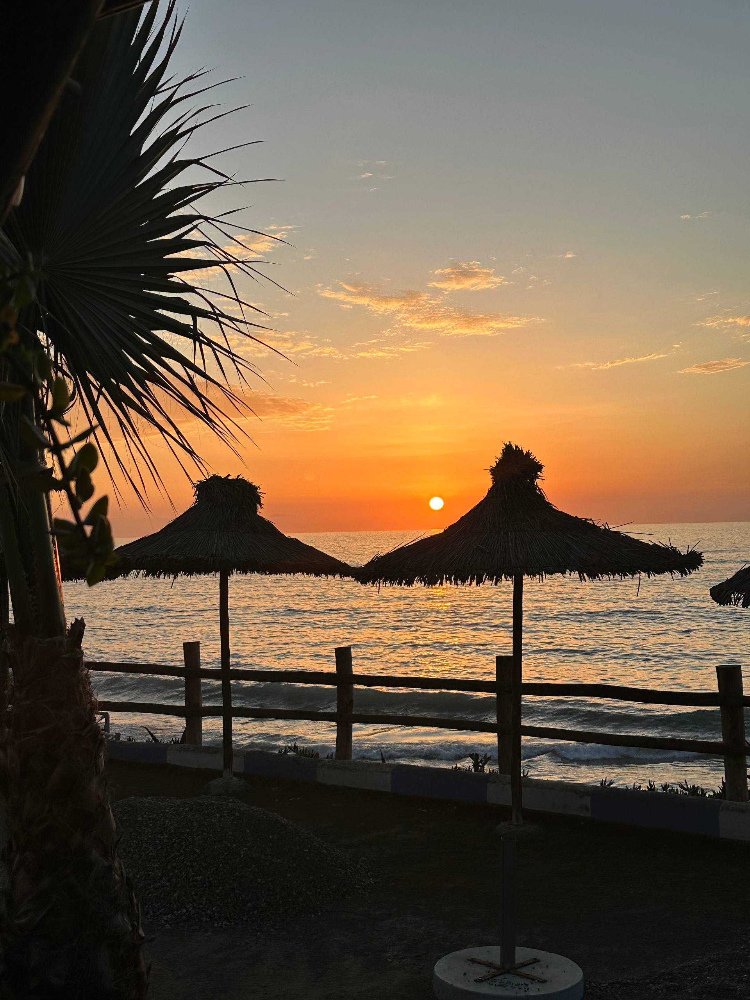
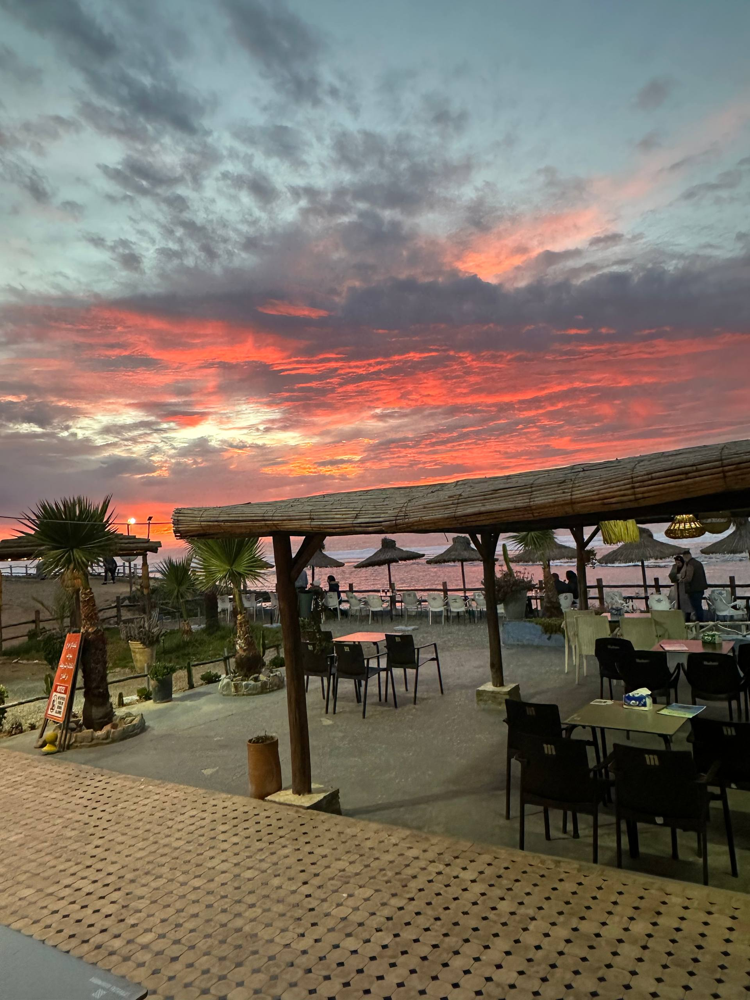
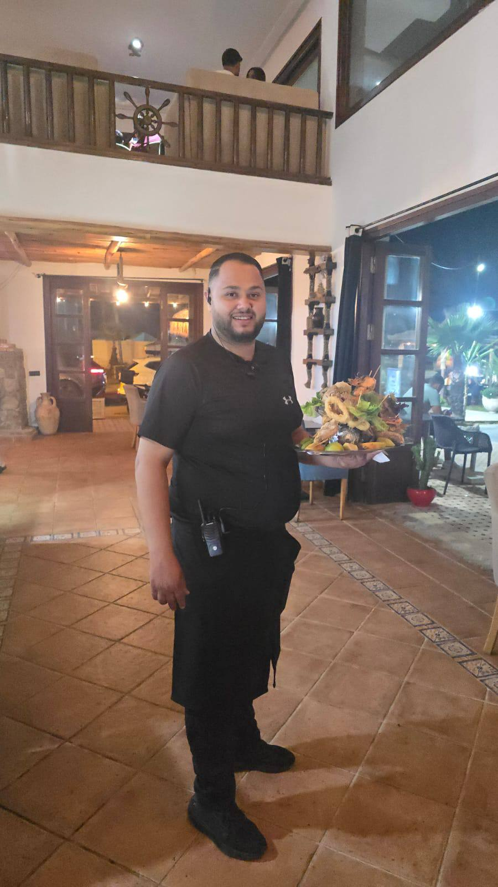

[index.html](https://github.com/user-attachments/files/28375044/index.html)

<!doctype html>
<html lang="en">
<head>
  <meta charset="utf-8">
  <meta name="viewport" content="width=device-width, initial-scale=1">
  <title>cafedaya.com | Cafe daya</title>
  <meta name="description" content="Cafe Daya beach cafe restaurant menu, real restaurant photos, staff, reviews and complaints.">
  <link rel="stylesheet" href="styles.css">
</head>
<body>
  <header class="site-header" aria-label="Cafe Daya navigation">
    <a class="brand" href="#home" aria-label="Cafe Daya home">
      Cafe daya
    </a>
    <nav>
      <a href="#menu">Menu</a>
      <a href="#gallery">Gallery</a>
      <a href="#staff">Staff</a>
      <a href="#feedback">Reviews</a>
      <a class="instagram-link" href="https://www.instagram.com/cafedaya/">IG @cafedaya</a>
    </nav>
  </header>

  <main>
    <section id="home" class="hero">
      <picture>
        <source srcset="assets/photo_2026-05-16_12-26-14.jpg">
        
      </picture>
      

      

        
Beach cafe restaurant in Asilah

        <h1>Cafe Daya</h1>
        
Fresh seafood, Moroccan breakfasts, pizza, juices, coffee and sunset tables by the ocean.

        

          <a class="button primary" href="#menu">View menu</a>
          <a class="button ghost" href="#feedback">Write a review</a>
        

      

    </section>

    <section class="intro">
      

        
Welcome

        <h2>Ocean view, warm service, everyday favorites.</h2>
      

      
Cafe Daya brings together seaside tables, Moroccan hospitality and a wide menu for breakfast, lunch, dinner and coffee breaks. The website below uses your real restaurant and menu photos so customers know the place before they arrive.

    </section>

    <section id="menu" class="menu-section">
      

        
Menu

        <h2>Our Products</h2>
      

      

        <a href="#breakfast">Breakfast</a>
        <a href="#pizza">Pizza</a>
        <a href="#snacks">Snacks</a>
        <a href="#salads">Salads</a>
        <a href="#fish">Fish per kg</a>
        <a href="#hot-pasta">Hot & Pasta</a>
        <a href="#plates">Plates</a>
        <a href="#crepes">Crepes</a>
        <a href="#icecream">Ice Cream</a>
        <a href="#sweets">Sweets</a>
        <a href="#cold-drinks">Cold Drinks</a>
        <a href="#hot-drinks">Hot Drinks</a>
        <a href="#extras">Extras</a>
      

      

        

          <article class="menu-category" id="breakfast">
            

              

                
Menu page

                <h3>Petit Dejeuner Daya</h3>
              

              
            

            

              
Marocain<strong>52 DH</strong>

              
Hollandais<strong>58 DH</strong>

              
Parisien<strong>48 DH</strong>

              
Espagnole<strong>48 DH</strong>

              
Fassi<strong>58 DH</strong>

              
Petit Dejeuner d'Enfant<strong>35 DH</strong>

              
Toaste Tarte Avocat<strong>70 DH</strong>

              
Omelette Fromage<strong>25 DH</strong>

              
Omelette Dinde Fumee<strong>25 DH</strong>

              
Omelette Fromage, Dinde Fumee<strong>30 DH</strong>

              
Omelette Naturel<strong>18 DH</strong>

              
Croque Fromage<strong>35 DH</strong>

              
Croque Dinde Fumee<strong>35 DH</strong>

              
Croque Fromage, Dinde Fumee<strong>40 DH</strong>

            

          </article>

          <article class="menu-category" id="pizza">
            

              

                
Menu page

                <h3>Pizza</h3>
              

              
            

            

              
Margarita<strong>55 DH</strong>

              
Poulet<strong>80 DH</strong>

              
Viande Hachee<strong>85 DH</strong>

              
Vegetarienne<strong>60 DH</strong>

              
Thon<strong>65 DH</strong>

              
Fruit de Mer<strong>95 DH</strong>

              
Quatre Saisons<strong>100 DH</strong>

              
Moitie-Moitie<strong>80 DH</strong>

            

          </article>

          <article class="menu-category" id="snacks">
            

              

                
Fast menu

                <h3>Tacos, Burger, Panini</h3>
              

              
            

            

              
Tacos Poulet<strong>50 DH</strong>

              
Tacos Viande Hachee<strong>55 DH</strong>

              
Tacos Fruit de Mer<strong>70 DH</strong>

              
Tacos Mixte<strong>65 DH</strong>

              
Hamburger<strong>40 DH</strong>

              
Cheese Burger<strong>40 DH</strong>

              
Chicken Burger<strong>40 DH</strong>

              
Big Burger<strong>50 DH</strong>

              
Panini Poulet<strong>40 DH</strong>

              
Panini Thon<strong>45 DH</strong>

              
Panini Viande Hachee<strong>55 DH</strong>

              
Panini Crevette<strong>40 DH</strong>

              
Panini Fruit de Mer<strong>55 DH</strong>

            

          </article>

          <article class="menu-category" id="salads">
            

              

                
Fresh menu

                <h3>Salades & Tajine</h3>
              

              
            

            

              
Salade Marocaine<strong>35 DH</strong>

              
Salade Nicoise<strong>45 DH</strong>

              
Salade Avocat Crevette<strong>55 DH</strong>

              
Salade Fruit<strong>60 DH</strong>

              
Tajine Poulet<strong>Sur commande</strong>

              
Tajine Viande<strong>Sur commande</strong>

              
Tajine Poisson<strong>Sur commande</strong>

            

          </article>

          <article class="menu-category fish-feature" id="fish">
            

              

                
House specialty

                <h3>Fish & Seafood per kg</h3>
                
Fresh fish is one of the best things Cafe Daya prepares. Choose from the daily catch and ask the server for today's selection and price per kg.

              

              
            

            

              
Fresh Fish<strong>Per kg</strong>

              
Poisson<strong>Par kg</strong>

              
Grilled Fish Preparation<strong>Ask server</strong>

              
Seafood Plate Selection<strong>Ask server</strong>

            

          </article>

          <article class="menu-category" id="hot-pasta">
            

              

                
Warm dishes

                <h3>Entree Chaud & Les Pates</h3>
              

              
            

            

              
Soupe Fruit de Mer<strong>55 DH</strong>

              
Tajine Pil Pil<strong>60 DH</strong>

              
Espadon Rigamonte<strong>80 DH</strong>

              
Pates Vegetarienne<strong>60 DH</strong>

              
Pates Poulet Champignon<strong>70 DH</strong>

              
Pates Bolognaise<strong>80 DH</strong>

              
Pates Fruit de Mer<strong>90 DH</strong>

            

          </article>

          <article class="menu-category" id="plates">
            

              

                
Main plates

                <h3>Les Plats</h3>
              

              
            

            

              
Filet de Poulet Sauce Champignon<strong>90 DH</strong>

              
Escalope de Poulet Creme Fromage<strong>80 DH</strong>

              
Emince de Dinde<strong>85 DH</strong>

              
Brochette de Viande<strong>150 DH</strong>

              
Brochette de Poulet<strong>100 DH</strong>

              
Pave Espadon a la Plancha Creme de Crevette et Citron<strong>110 DH</strong>

              
Brochette de Poisson<strong>110 DH</strong>

              
Calamar Sauvage<strong>185 DH</strong>

              
Calamar Passamane<strong>140 DH</strong>

              
Merlan<strong>145 DH</strong>

              
Sole<strong>150 DH</strong>

              
Crevette<strong>150 DH</strong>

              
Espadon<strong>165 DH</strong>

              
Paella Valencienne<strong>90 DH</strong>

              
Paella Special<strong>100 DH</strong>

              
Mixte<strong>250 DH</strong>

            

          </article>

          <article class="menu-category" id="crepes">
            

              

                
Sweet and salty

                <h3>Crepes</h3>
              

              
            

            

              
Crepe Nature<strong>18 DH</strong>

              
Crepe Nutella<strong>32 DH</strong>

              
Crepe Miel<strong>22 DH</strong>

              
Crepe Caramel<strong>28 DH</strong>

              
Crepe Confiture<strong>22 DH</strong>

              
Crepe Amlou<strong>30 DH</strong>

              
Crepe Tropical<strong>45 DH</strong>

              
Crepe Salee Poulet Champignon<strong>60 DH</strong>

              
Crepe Salee Dinde Fumee Fromage<strong>50 DH</strong>

            

          </article>

          <article class="menu-category" id="icecream">
            

              

                
Dessert

                <h3>Boules de Glace</h3>
              

              
            

            

              
2 Boules de Glace<strong>30 DH</strong>

              
3 Boules de Glace<strong>45 DH</strong>

              
4 Boules de Glace<strong>55 DH</strong>

              
5 Boules de Glace<strong>67 DH</strong>

              
Ice Coffee<strong>30 DH</strong>

            

          </article>

          <article class="menu-category" id="sweets">
            

              

                
Sweets

                <h3>Patisserie & Gateau Marocain</h3>
              

              
            

            

              
Patisserie du Jour<strong>30 DH</strong>

              
Gateau Marocain<strong>10 DH</strong>

            

          </article>

          <article class="menu-category" id="cold-drinks">
            

              

                
Cold drinks

                <h3>Jus, Cocktails & Boissons Froides</h3>
              

              
            

            

              
Jus Orange<strong>34 DH</strong>

              
Jus Citron<strong>25 DH</strong>

              
Jus Banane<strong>38 DH</strong>

              
Jus Pomme<strong>38 DH</strong>

              
Jus Amande<strong>42 DH</strong>

              
Jus Fraise<strong>45 DH</strong>

              
Jus Peche<strong>42 DH</strong>

              
Jus Ananas<strong>48 DH</strong>

              
Jus Avocat<strong>45 DH</strong>

              
Jus Avocat Fruit Sec<strong>55 DH</strong>

              
Jus Mangue<strong>48 DH</strong>

              
Jus Dragon<strong>60 DH</strong>

              
Jus Kiwi<strong>45 DH</strong>

              
Jus Panache<strong>50 DH</strong>

              
Jus Fruit Rouge<strong>68 DH</strong>

              
Cocktail Tropicano<strong>50 DH</strong>

              
Mojito<strong>50 DH</strong>

              
Mojito Red Bull<strong>70 DH</strong>

              
Frappuccino Fraise<strong>35 DH</strong>

              
Frappuccino Caramel<strong>35 DH</strong>

              
Frappuccino Chocolat<strong>35 DH</strong>

              
Milkshake<strong>50 DH</strong>

              
Cafe Froid<strong>20 DH</strong>

              
Oulmes<strong>18 DH</strong>

              
Eau Minerale en Verre<strong>18 DH</strong>

              
Eau Minerale 1.5L<strong>12 DH</strong>

              
Eau Minerale 0.5L<strong>08 DH</strong>

              
Soda<strong>18 DH</strong>

              
Boisson Energie<strong>40 DH</strong>

            

          </article>

          <article class="menu-category" id="hot-drinks">
            

              

                
Hot drinks

                <h3>Boissons Chaudes & Cappuccino</h3>
              

              
            

            

              
Chocolat Chantilly<strong>25 DH</strong>

              
Cappuccino Creme Chantilly<strong>30 DH</strong>

              
Cappuccino Creme sans Chantilly<strong>22 DH</strong>

              
Cafe Royale<strong>22 DH</strong>

              
Cafe Noir + Eau<strong>20 DH</strong>

              
Cafe au Lait + Eau<strong>20 DH</strong>

              
The Vert + Eau<strong>20 DH</strong>

              
The Noir + Eau<strong>20 DH</strong>

              
The Americain + Eau<strong>20 DH</strong>

              
The English<strong>20 DH</strong>

              
Lait Chaud + Eau<strong>20 DH</strong>

              
Chocolat Chaud + Eau<strong>20 DH</strong>

            

          </article>

          <article class="menu-category" id="extras">
            

              

                
Clear add-ons

                <h3>Extras & Accompagnements</h3>
              

              

                
                
              

            

            

              
Extra Banane<strong>10 DH</strong>

              
Extra Amande<strong>10 DH</strong>

              
Extra Oreo<strong>10 DH</strong>

              
Extra Lotus<strong>10 DH</strong>

              
Harsha<strong>10 DH</strong>

              
Rghayef<strong>10 DH</strong>

              
Pain Poele<strong>10 DH</strong>

              
Toast au Fromage<strong>15 DH</strong>

              
Oeuf Dur<strong>07 DH</strong>

              
Amlou<strong>05 DH</strong>

              
Dinde Fumee<strong>12 DH</strong>

              
Fromage Rouge<strong>12 DH</strong>

              
Nutella<strong>10 DH</strong>

              
Jben Arabi<strong>05 DH</strong>

              
Miel<strong>05 DH</strong>

              
Beurre<strong>05 DH</strong>

              
Confiture<strong>05 DH</strong>

            

          </article>
        

      

    </section>

    <section id="gallery" class="gallery-section">
      

        
Real photos

        <h2>See the Restaurant</h2>
      

      

        
        
        
        
        
        
      

    </section>

    <section id="staff" class="staff-section">
      

        
Team

        <h2>Our Servers</h2>
      

      

        

          <article class="staff-card">
            
            <h3>Ousama</h3>
            
Server at Cafe Daya. Customers can send a review or complaint about Ousama in the feedback form.

          </article>
          <article class="staff-card">
            
            <h3>Dahman</h3>
            
Server at Cafe Daya. Customers can send a review or complaint about Dahman in the feedback form.

          </article>
          <article class="staff-card">
            
            <h3>Abderahman</h3>
            
Server at Cafe Daya. Customers can send a review or complaint about Abderahman in the feedback form.

          </article>
          <article class="staff-card">
            
            <h3>Mesbahi</h3>
            
Server at Cafe Daya. Customers can send a review or complaint about Mesbahi in the feedback form.

          </article>
          <article class="staff-card">
            
            <h3>ABSLAM</h3>
            
Server at Cafe Daya. Customers can send a review or complaint about ABSLAM in the feedback form.

          </article>
        

        <aside id="feedback" class="feedback-layout">
          

            
Customer voice

            <h2>Review or Complaint</h2>
          

        <form id="feedbackForm" class="feedback-form" action="https://formsubmit.co/daya1@cafedaya.com" method="POST">
          <input type="hidden" name="_subject" value="Cafe Daya review or complaint">
          <input type="hidden" name="_template" value="table">
          <input type="hidden" name="_captcha" value="false">
          <input type="hidden" name="_next" value="http://127.0.0.1:8787/#feedback">
          <label>
            Email or phone number (required)
            <input
              name="Contact"
              type="text"
              autocomplete="email"
              pattern="([a-zA-Z0-9._%+\-]+@[a-zA-Z0-9.\-]+\.[a-zA-Z]{2,}|\+?[0-9][0-9\s().-]{7,}[0-9])"
              title="Enter a valid email address or phone number"
              required
            >
          </label>
          <fieldset class="review-about">
            <legend>Review about</legend>
            <label><input type="radio" name="Review about" value="Restaurant" required> Restaurant</label>
            <label><input type="radio" name="Review about" value="Ousama - Server"> Ousama - Server</label>
            <label><input type="radio" name="Review about" value="Dahman - Server"> Dahman - Server</label>
            <label><input type="radio" name="Review about" value="Abderahman - Server"> Abderahman - Server</label>
            <label><input type="radio" name="Review about" value="Mesbahi - Server"> Mesbahi - Server</label>
            <label><input type="radio" name="Review about" value="ABSLAM - Server"> ABSLAM - Server</label>
          </fieldset>
          <label>
            Write your message
            <textarea name="Message" rows="5" placeholder="Tell us about your experience..." required></textarea>
          </label>
          

            <button class="button primary" type="submit">Send review or complaint</button>
          

          
This sends the review or complaint directly to daya1@cafedaya.com.

        </form>
        </aside>
      

    </section>
  </main>

  <footer>
    

      <strong>Cafe Daya</strong>
      Instagram: @cafedaya
    

    <a href="#home">Back to top</a>
  </footer>

</body>
</html>
